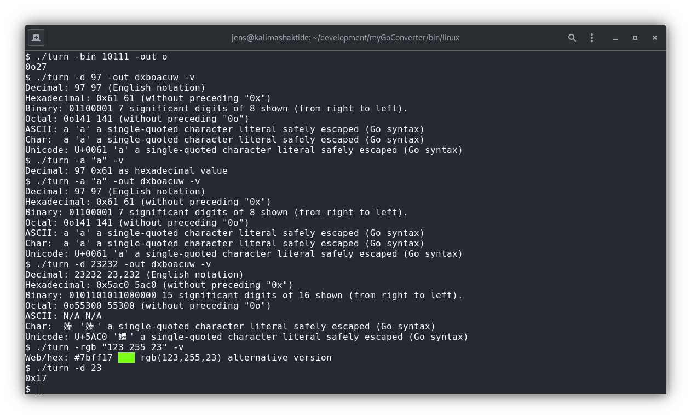

# The TURNer [](https://github.com/jagottsicher/myGoConverter/actions)
## Dedicated to Will Turner<sup>[1](#dedication)</sup>
### Description:
The TURNer is a command line tool for Linux, Windows and macOS which allows to convert values of different (mostly numeric) types and units commonly used in information technology into different notations.

The output goes directly to sdtout to make it usable for other command-line tools, respectively handle it over as values in pipes.



Example: Converts the decimal number "23" into a binary representation

```turn -d 23 -out bx```
ouputs:
```
00010111
0x17
```
Also try ```turn -rgb "123 255 23" -out wx -v``` or ```turn -d 97 -out bxoau -v```.

Correct usage of turn:

```
turn [-inputType] <inputValue> [-out] {d|x|w|o|b|r|rgb|c|a|u} [-v]

Possible input type flags are:  
  -d, --decimal	decimal number	
  -x, --hex	hexadecimal number with or without preceeding "0x" or "0X"  
  -o, --octal	octal number with or without preceeding "0o" or "0O"  
  -bin,--bit	binary number as sequence of zeros and ones without whitespace  
  -rgb	rgb	values in a string. Whitespaces need doubles quotes. Examples: "-rgb r123g255b23" or -rgb "123 255 23" or -rgb "123, 255, 23"  
  -r -g -b	🟥 🟩 🟦 as 8-bit decimal value (0-255). Absent values will be considered as zero. Examples "-r 123 -g 255 -b23" or "-g 255"  
  -rgbx		rgb values as hexadecimal triplet as a string. Example: "-rgbx 7bff17"  
  -a, --asc	a string beginning with an ASCII encoded character. Only the first character is considered.

Output flag:  
  -out, --output  indicates a list of desired output formats where applicable. A value of a default type is output if -out flag is omitted.

Possible output type arguments as are:  
  d		decimal number format  
  x		hexadecimal number format  
  b		binary number format  
  o		octal format  
  a		ASCII representation where applicable  
  c		character representation where applicable  
  u		UTF-8 representation where applicable  
  w, web	web formats  
  
Other flags:  
  -l, --loop		loop mode, repeatingly recalling last input and overwrite/edit flags/arguments  
  -v, --verbose		outputs additional information alternative versions/formats  
  -h, --help		outputs this help text  
  -v, -ver, --version	outputs the version number if no other flags are present

Note:  
Order of the desired output types will be considered.  
Color output dependent of your terminal's abilities and settings.  

First version developed as a project for the CS50 course "Introduction to Computer Science" of the Harvard University 2022.  
Made with ❤️ and the Go programming language.
```
### Installation:
You can install a binary for your operation system from the [releases](https://github.com/jagottsicher/myGoConverter/releases) or you can build your own version from the the source code and install that in your path. see more detailed instructions on [INSTALL.md](https://github.com/jagottsicher/myGoConverter/blob/main/INSTALL.md).

<hr>

<sup><a name="dedication">1</a></sup>Will Turner Jr., the fictional character in the Pirates of the Caribbean films.  

Will Turner, embodied by Orlando Bloom. On the one hand, Will Turner represents a typical member of the hard-working middle class with gifted manual skills; on the other hand, due to his background and these very skills, he is an aspiring character who strives for change and to break out of the role assigned to him by society. In particular, next to the extroverted Jack Sparrow (Johnny Depp), Will Turner appears like a mixture of an unintentionally funny Guybrush Threepwood and an old-style swashbuckler, like an Errol Flynn embodied in his best days.  

The crucial point is that Will Turner had a large repertoire of outstanding skills, which he was ready to use for others and for the good of society, turning one thing into another as a blacksmith and turning both his own destiny and that of those around him. Just as "The TURNer" should be a helpful and universally applicable tool.
